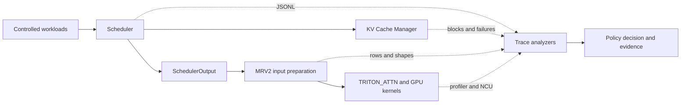

# vLLM v0.26 Scheduler Trace Lab

## 从这里开始

这个分支固定在 vLLM v0.26.0，增加了可关闭的 Scheduler/MRV2 trace、精确
token workload、KV 压力实验、waiting HOL 策略对照和 GPU profiling 证据。
默认 vLLM 行为在实验开关关闭时保持不变。



| 阅读目标 | 入口 |
|---|---|
| 快速了解问题、实现和结果 | 本文 |
| 阅读完整工程结论 | [完整报告](scheduler_trace_lab_final_report.md) |
| 运行受控 workload | [复现指南](../benchmarks/scheduler_trace/README.md) |
| 查看 Scheduler 到 MRV2 数据流 | [数据流报告](scheduler_to_model_runner.md) |
| 查看策略收益与反例 | [重复实验](day14_waiting_hol_benchmark.md)、[策略审计](day15_waiting_bypass_pr_audit.md) |
| 查看 GPU profiling | [Scheduler-to-kernel](day16_nsys_systems_gate.md)、[NCU](day17_ncu_gate.md) |
| 查看最终 PR 决策 | [项目复盘](day20_project_review_and_pr_gate.md) |

## 工程摘要

### 为什么做

请求级 TTFT/TPOT 只能表明延迟变化，不能回答哪个 Scheduler step、哪次 KV
allocation 或哪个 MRV2 batch 造成了等待。本项目建立可复现的 trace，让调度
决策、KV 状态、MRV2 input shape 和 GPU 工作组成可以在同一个证据链中解释。

### 改了哪里

- 默认关闭的 Scheduler/MRV2 JSONL trace；
- 可控的精确 token workload generator；
- trace 到 CSV、benchmark aggregate 和 profiler alignment 分析器；
- 默认关闭的 one-admission waiting bypass；
- Scheduler、workload 和 analyzer 的针对性测试。

### 代码地图

| 范围 | 主要文件 |
|---|---|
| Scheduler trace 与 waiting admission | [scheduler.py](../vllm/v1/core/sched/scheduler.py)、[trace.py](../vllm/v1/core/sched/trace.py) |
| MRV2 batch/input trace | [model_runner.py](../vllm/v1/worker/gpu/model_runner.py) |
| 配置与 CLI | [scheduler config](../vllm/config/scheduler.py)、[arguments](../vllm/engine/arg_utils.py) |
| Workload 与分析器 | [workload generator](../scripts/lab_v026_workload.py)、[scripts](../scripts/) |
| 可复现配置 | [scenario configs](../benchmarks/scheduler_trace/configs/) |
| 测试 | [lab tests](../tests/lab/)、[Scheduler tests](../tests/v1/core/test_scheduler.py) |

### 最重要的结果

- 复现真实 HOL witness：B full-ISL allocation failure 时 free blocks 放得下 C，
  但 strict FCFS 直接停止扫描；
- repeated 三请求实验中，bypass 将 C TTFT median 从 33.250 s 降至 0.182 s；
- 无界 burst 会把 B first step 从 517 推迟到 587，说明逐 step 重试不构成
  starvation bound；
- bounded 长生命周期 burst 新增 3 次 preemption，makespan +1.21%、throughput
  -1.20%、TTFT Jain -10.64%；
- 20-step profile 显示策略插入 1024-token Prefill，改变 batch shape 和 kernel
  mix，而不是 kernel 实现；
- NCU 对真实 Prefill GEMM 测得 24.67% achieved occupancy、84.01% L2 hit，
  主要 stall 为 61.85% `math_pipe_throttle`，不呈现简单 DRAM-latency-bound
  特征；该 targeted launch 不作具体 Scheduler step 或策略性能归因。

### 最终判断

不提交 upstream PR。本项目不以 patch 必须上线为验收条件；受控反例证明局部
优化缺少安全边界，因此停止继续堆叠 heuristic，并保留实现和负结果作为工程
证据。

## 快速复现入口

先验证配置，不启动 GPU：

```bash
/home/xiaoda/vllm-lab/.venv-v026/bin/python \
  scripts/lab_v026_workload.py \
  --config benchmarks/scheduler_trace/configs/d13_waiting_hol_blocking.json \
  --model /home/xiaoda/vllm-lab/models/Qwen2.5-0.5B-Instruct \
  --validate-only
```

运行 strict baseline：

```bash
VLLM_WSL2_ENABLE_PIN_MEMORY=1 VLLM_USE_V2_MODEL_RUNNER=1 \
  /home/xiaoda/vllm-lab/.venv-v026/bin/python \
  scripts/lab_v026_workload.py \
  --config benchmarks/scheduler_trace/configs/d13_waiting_hol_blocking.json \
  --model /home/xiaoda/vllm-lab/models/Qwen2.5-0.5B-Instruct \
  --num-gpu-blocks-override 1450 \
  --scheduler-trace --token-timing
```

Modified 只增加：

```text
--waiting-bypass on
```

每个 run 会在仓库外生成唯一目录，保存 commit、完整命令、resolved config、
request timing 和 Scheduler/MRV2 trace。详细复现矩阵见
`benchmarks/scheduler_trace/README.md`。

## 技术证据索引

| 工程问题 | 最直接的证据 |
|---|---|
| MRV2 在 WSL 怎么跑通 | `docs/environment_v026.md` |
| Trace 如何避免同步 | `docs/day4_scheduler_trace.md` |
| Scheduler 如何映射到 MRV2 | `docs/scheduler_to_model_runner.md` |
| KV allocation 与 preemption | `docs/day6_kv_cache_allocation.md`、`docs/day7_preemption.md` |
| 为什么没有重复实现 Prefill quantum | `docs/day11_policy_problem_selection.md` |
| HOL witness 与 patch | `docs/day13_waiting_hol_policy.md` |
| 收益和 starvation 反例 | `docs/day14_waiting_hol_benchmark.md` |
| bounded 为什么仍不安全 | `docs/day15_waiting_bypass_pr_audit.md` |
| 调度如何影响 GPU 工作 | `docs/day16_nsys_systems_gate.md` |
| NCU 单 kernel 说明什么 | `docs/day17_ncu_gate.md` |
| 完整工程报告 | `docs/scheduler_trace_lab_final_report.md` |

## 证据边界

- 目标 C 的 TTFT 变化只适用于特定三请求 Gate，不代表 vLLM 的普遍加速比例。
- 单次 burst 或 profiler window 不构成稳定性能结论。
- 实测 backend 是 `TRITON_ATTN`，不是 FlashAttention。
- Scheduler logical step 不是 GPU kernel 时间戳。
- bounded 策略没有解决 starvation，也没有可靠的生命周期上界。
- 单个 NCU launch 不能外推整个 Prefill 的 memory/compute-bound 属性；grid 尚未
  对齐时也不能归因给具体 Scheduler step 或策略。
